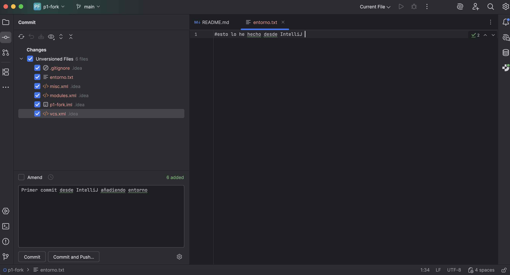
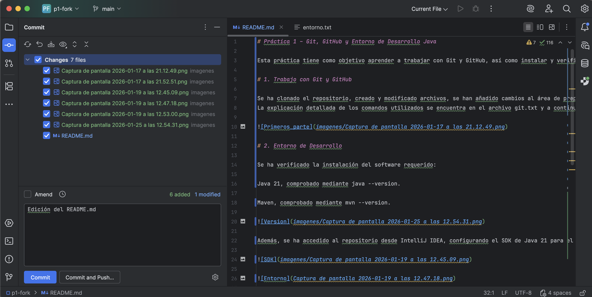

# Práctica 1 – Git, GitHub y Entorno de Desarrollo Java

Esta práctica tiene como objetivo aprender a trabajar con Git y GitHub, así como instalar y verificar el entorno de desarrollo necesario para Java. Para ello se ha realizado un fork del repositorio original, se ha trabajado en local con los comandos solicitados y finalmente se han subido todos los cambios al repositorio remoto.

# 1. Trabajo con Git y GitHub

Se ha clonado el repositorio, creado y modificado archivos, se han añadido cambios al área de preparación, realizado commits y enviado las actualizaciones al repositorio remoto.
La explicación detallada de los comandos utilizados se encuentra en el archivo git.txt y a continuación se muestra una captura con las evidencias del proceso realizado.

# 2. Entorno de Desarrollo

Se ha verificado la instalación del software requerido:

Java 21, comprobado mediante java --version.

Maven, comprobado mediante mvn --version.

Además, se ha accedido al repositorio desde IntelliJ IDEA, configurando el SDK de Java 21 para el proyecto. Desde el propio IDE se ha creado el archivo entorno.txt, se han realizado nuevos commits y se han subido los cambios a GitHub.

Por último se ha editado el README.md añadiendo las capturas relevantes a este y a la carpeta imagenes del repositorio. 

# 3. Estructura del Repositorio

El repositorio contiene los siguientes elementos principales:

git.txt – Explicación de los comandos Git utilizados.

entorno.txt – Creación del archivo mediante IntelliJ.

README.md – Informe general de la práctica.

Carpeta imagenes - Capturas del proceso.

# 4. Conclusión

La práctica permite entender el uso básico de Git, trabajar con GitHub y configurar el entorno necesario para el desarrollo en Java. Se han seguido todos los pasos indicados en el enunciado y se han aportado las evidencias correspondientes.